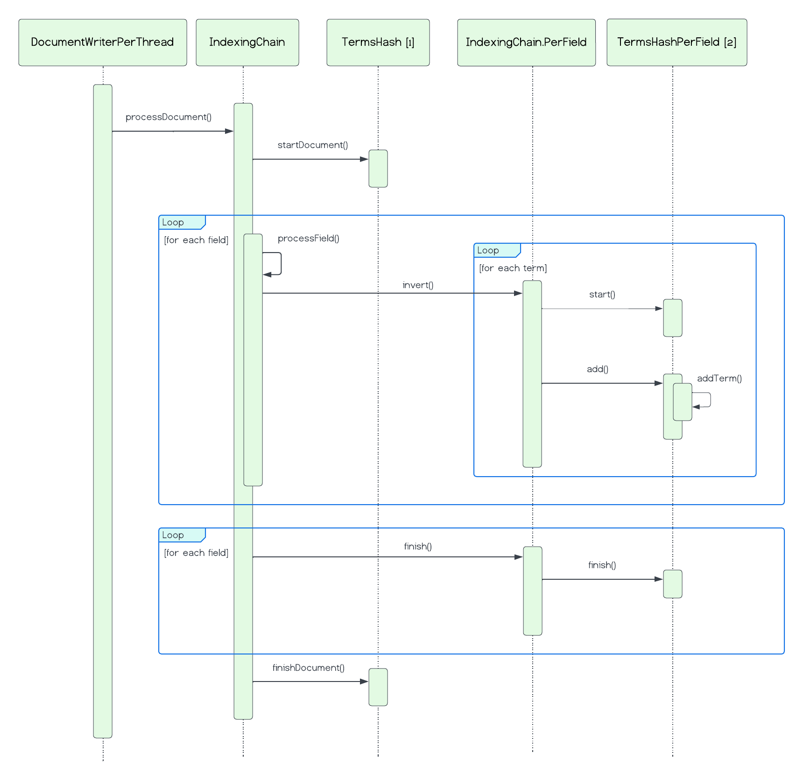
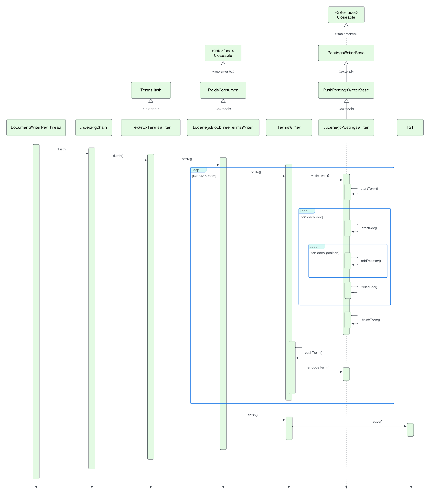

# Lucene Indexing Chain for Inverted Index

_Last updated: 2023-03-25_ (commit `0782535`)

These diagrams describe the relationship between the classes that play a key role in creating inverted indexes. (Note: For brevity, fine details are omitted.)

## Class diagram

- `DocumentWriterPerThread`: Document writer.
- `IndexingChain`: Default document indexing chain.
- `IndexingChain.PerField`: Performs indexing for a field.
- `TermsHash`: Stores indexed tokens in a hash table.
- `TermsHashPerField`: Stores streams of information per term.

## Sequence diagram

### Index construction on memory

[1] FreqProxTermsWriter

[2] FreqProxTermsWriterPerField

### Flushing index data to disk

